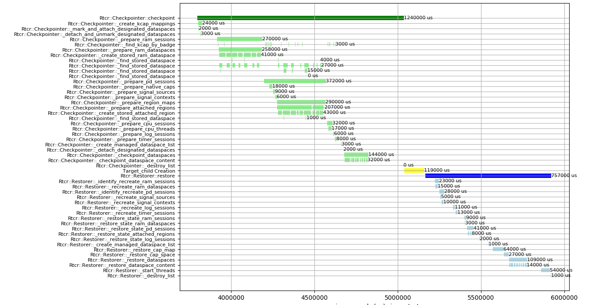

# Serial Log Communication Profiler



# OS Requirements

Pythons `matplotlib` is required.

```bash
sudo apt-get install python3-pip
sudo pip3 install matplotlib
```

# Application Integration

1. Include `<util/profiler.h>` in your Application
2. Create a Timer Session and make it available in every function which should
   be profiled.

3. Every function, which should be profiled requires the macro
   `PROFILE_FUNCTION(color, timer)` at the beginning. The attribute `color` is a
   string like `blue`, and `timer` is the timer instance.

4. In order to profile a code area, put this code in a seperate Scope and
   include `PROFILE_SCOPE(name, color, timer)` in the beginning of the
   scope. The variable name is a string and represents the measurement in the
   plot. Example:
   ```C++
   {
     PROFILE_SCOPE("simple-print", "yellow", _timer)
	 Genode::log("Hello World")
   }
   ```

5. (Optional) If you want to use automatic logging, filtering and plotting of
   your profiling data whenever your application runs in Qemu, the run file
   requires some adjustments.
   1. Source the `profiler.inc` from `genode-Profiler`.
	  ```
	  source ${genode_dir}/../genode-Profiler/run/profiler.inc
	  ```
   2. Call `profiler_enable_log` before qemu is started. This enables logging
      and prepares the necessary log directory.

   3. After the execution of qemu with the `run_genode_until` function, add
      `profiler_postprocess` to your run file. This function will filter the log
      file for profiling information and creates the plot afterwards.


# Genode Integration

1. Clone this repository to the root directory of your Genode.

2. Add this repository to the variable REPOSITORIES in `build.conf`.
   ```
   REPOSITORIES += $(GENODE_DIR)/../genode-Profiler
   ```


# Further documentation
Further documentation is in directory `doc`.

* [Implementation](./doc/implementation.md)
* [Summary Profiling Techniques](./doc/profiler_techniques.md)
